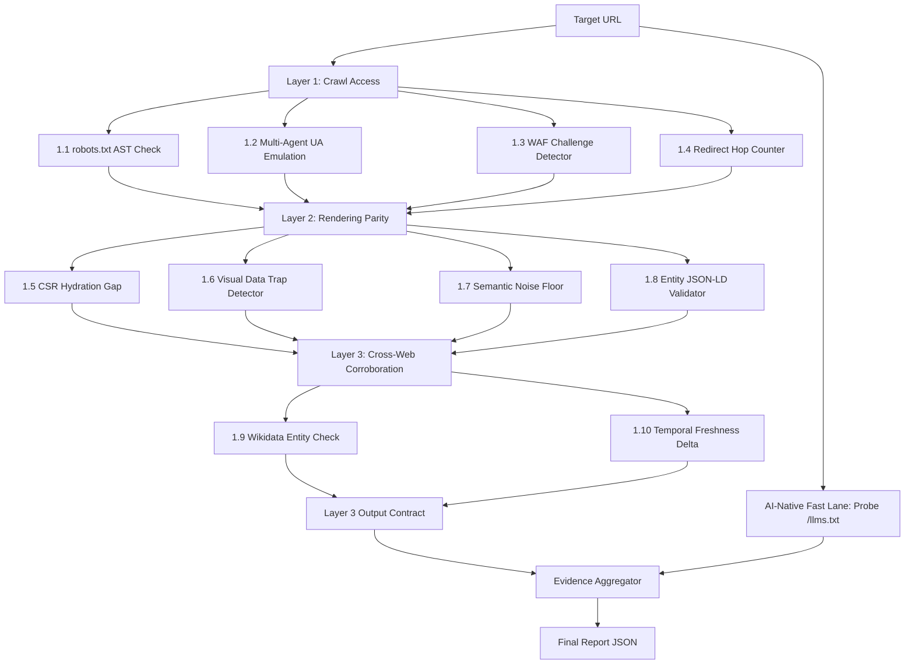
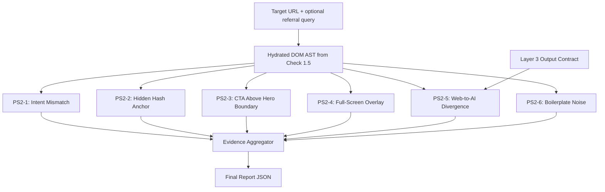
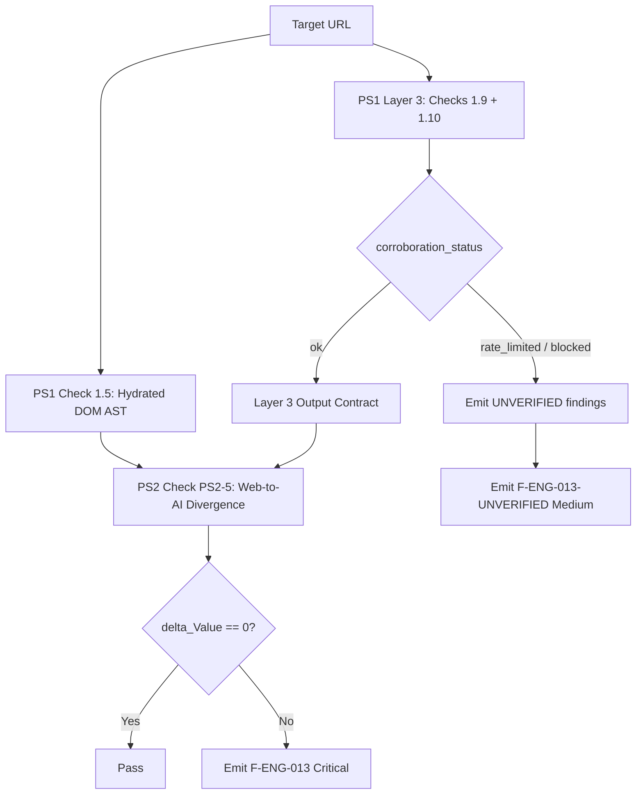

# Adobe Round 3 - Internal Engineering Specification

> **Audience:** Implementing engineer or coding agent. Not for judges.
> Hard-constraint conflicts are flagged explicitly. Nothing is silently rewritten.

---

## Runtime Contract (Hard Constraints)

| Constraint | Value |
|---|---|
| HTTP runtime | Raw httpx / aiohttp async fetch only |
| JS execution | QuickJS or PyMiniRacer (embedded, in-process) |
| DOM tree | Virtual DOM via JS polyfill. NO CSS layout engine. |
| Pixel geometry | FORBIDDEN as a detection trigger. CSS-declarative signatures only. |
| Chromium / headless browser | FORBIDDEN as bundled or assumed dependency |
| Browser tool (optional) | May append pixel value to evidence string ONLY. Never changes fire/severity. Must be timeout-wrapped; failure is silent. |
| Submission zip | <= 50 MB, no bundled model weights |
| Full audit runtime | < 5 minutes on a typical site |
| Findings array | NEVER empty. Proactive finding required on fully-passing sites. |
| Corroboration failure | Emit explicit "unable to verify" finding. Never crash, never silently pass. |

---

## Problem Statement 1: Off-Site Discoverability

Why AI assistants (ChatGPT, Claude, Perplexity) fail to find, cite, or accurately represent a website.

### 1A. Pipeline Flowchart



**Layer 3 Output Contract (consumed by PS2-5):**
```json
{
  "brand_name": "string",
  "offsite_price_str": "string",
  "offsite_price_num": "float",
  "offsite_year_max": "int",
  "offsite_snippets": ["string"],
  "wikidata_entity_found": "bool",
  "wikidata_qid": "string|null",
  "corroboration_status": "ok | rate_limited | blocked"
}
```

---

### Check 1.1 - robots.txt AI Agent Disallow

**Finding ID:** F-NET-001

**WHY (failure mode):**
Appendix A: "The crawler has to be let in." robots.txt Disallow rules targeting AI user-agents (GPTBot, ClaudeBot, PerplexityBot, Google-Extended) are the first and hardest gate. A compliant AI crawler aborts at this step before any other logic runs. The page effectively does not exist for that AI system, regardless of how well-optimized everything else is.

**Algorithm:**
1. Fetch `{root_url}/robots.txt` with a neutral user-agent. Timeout: 5s.
2. Parse line-by-line. Collect all `User-agent:` blocks.
3. For each agent string in [GPTBot, ClaudeBot, PerplexityBot, OAI-SearchBot, Google-Extended], check if a matching block contains `Disallow: /` or `Disallow: /<path>` covering the target URL.
4. Record blocked agents list and their specific Disallow paths.

**Rule Trigger:**
IF any AI-specific user-agent block contains `Disallow: /` (or path covering target URL), emit F-NET-001, Severity: Critical.

**Evidence Template:**
`"robots.txt explicitly disallows GPTBot with 'Disallow: /' (line 12) and ClaudeBot with 'Disallow: /blog/' (line 18). 2 of 5 tested AI crawlers blocked at access gate."`

**STATUS:** Resolved

**Definition of Done:**
- robots.txt with `User-agent: GPTBot / Disallow: /` fires F-NET-001 Critical.
- robots.txt with no AI-agent blocks produces no finding.
- 404 on robots.txt produces no finding (absence = no restriction).

**Dependencies:** None. First check. Output (blocked agents list) consumed by Check 1.2 for report context.

---

### Check 1.2 - Multi-Agent User-Agent Emulation (TTFB Variance)

**Finding IDs:** F-NET-002 (absolute block), F-NET-003 (relative throttle)

**WHY (failure mode):**
Appendix A: Even when robots.txt allows a bot, WAF rules at the edge layer (Cloudflare, AWS WAF) identify AI bots via IP reputation or missing TLS fingerprints and drop or throttle the request with 403/429/503. A site can appear fully open to a browser while silently blocking every AI crawler. This is undetectable from robots.txt alone.

**Algorithm:**
1. Send 5 parallel async HTTP GET requests to target URL root, each with a different User-Agent: GPTBot/1.1, ClaudeBot, PerplexityBot, OAI-SearchBot, standard browser UA (baseline). All other headers identical.
2. Record HTTP status code and TTFB for each.
3. Absolute check: For each AI agent, if HTTP status in {403, 429, 503}, emit F-NET-002.
4. Relative check: R_TTFB = TTFB_bot / TTFB_baseline. delta_TTFB = TTFB_bot - TTFB_baseline. If R_TTFB > 2.5 OR delta_TTFB > 500ms, emit F-NET-003.
5. WAF Silent Block sub-check: If HTTP 200 but response body contains cf-browser-verification, g-recaptcha, turnstile, cf-mitigated, challenge-form as DOM element IDs/script src patterns (AST scan, not substring match), emit F-NET-002 with note SILENT_WAF_BLOCK.

| Finding | Condition | Severity |
|---|---|---|
| F-NET-002 | HTTP 403/429/503 for AI UA | Critical |
| F-NET-002 | HTTP 200 + WAF challenge body | Critical |
| F-NET-003 | R_TTFB > 2.5x or delta > 500ms | High |

**Evidence Templates:**
- `"GPTBot received HTTP 403 Forbidden; browser UA received HTTP 200 OK. Site actively blocks AI crawlers at WAF layer."`
- `"GPTBot TTFB 1240ms is 3.1x browser baseline (400ms), delta = +840ms. Edge WAF rate-shaping."`
- `"GPTBot received HTTP 200 with body containing DOM element id='challenge-form' and script src matching /turnstile/. Silent WAF block confirmed."`

**STATUS:** Partially Resolved
Open sub-issue: WAF selector set (challenge-form, Turnstile) covers Cloudflare and reCAPTCHA only. Other WAF vendors (Akamai, Imperva) use different challenge markup. Expand during field testing.

**Definition of Done:**
- Cloudflare-protected URL returns 200 with Turnstile markup: fires F-NET-002 (SILENT_WAF_BLOCK).
- 403-returning URL under GPTBot UA: fires F-NET-002 Critical.
- Mock server with bot-specific delay: fires F-NET-003 at threshold.

**Dependencies:** None.

---

### Check 1.3 - Redirect Hop Counter

**Finding ID:** F-NET-004

**WHY (failure mode):**
Appendix A: AI crawlers operate on strict single-hop latency constraints. A 3-hop redirect chain (http -> https -> www-redirect -> canonical) adds 300-600ms overhead and causes crawlers with hard timeouts to abort before reading any content.

**Algorithm:**
1. Configure HTTP client with `follow_redirects=False`.
2. Send request to target URL. If status is 3xx, extract Location header, increment hop_count, re-issue to new URL.
3. Continue loop. Record every intermediate URL.
4. If hop_count > 1, abort and emit F-NET-004.

**Rule Trigger:**
IF hop_count > 1 across full redirect chain, emit F-NET-004, Severity: High.

**Evidence Template:**
`"Target URL redirect chain length is 3 hops: http://a -> https://a -> https://www.a. Adds ~420ms overhead. Exceeds max 1-hop constraint for AI crawler compatibility."`

**STATUS:** Resolved

**Definition of Done:**
- 3-hop chain fires F-NET-004 with all intermediate URLs listed.
- 1 redirect (http->https only) passes.
- No redirect passes.

**Dependencies:** None.

---

### Check 1.4 - llms.txt / llms-full.txt Discovery

**Finding IDs:** F-LLMS-001 (absence), F-LLMS-OK (proactive, if present)

**WHY (failure mode):**
The llms.txt standard provides a clean Markdown payload at a known path that AI crawlers can fetch in a single hop without HTML parsing, JS execution, or rendering. Its presence is a strong positive discoverability signal and can bypass Layers 1-2 entirely.

**Algorithm:**
1. Fetch `{root_url}/llms.txt` and `{root_url}/llms-full.txt`. Timeout: 5s each.
2. If either returns HTTP 200 with Content-Type containing text/ or markdown, record as found.
3. Validate: must be valid Markdown (no HTML scaffold, no JS), contain at least one heading, content length > 200 bytes.

**Rule Trigger:**
- IF neither file found: emit F-LLMS-001, Severity: Medium.
- IF found and valid: emit F-LLMS-OK (Severity: info).

**Evidence Templates:**
- `"Neither /llms.txt nor /llms-full.txt found at root (both HTTP 404). No AI-native fast-lane endpoint."`
- `"Found /llms.txt (HTTP 200, 1842 bytes, valid Markdown, 3 headings). AI-native content endpoint available."`

**STATUS:** Resolved

**Definition of Done:**
- Valid /llms.txt: proactive finding fires, no F-LLMS-001.
- Neither file: F-LLMS-001 fires.
- /llms.txt returns 200 but HTML content: treated as absent (validation fails).

**Dependencies:** None. Should run first. Valid llms.txt short-circuits rendering checks.

---

### Check 1.5 - CSR Hydration Gap (Rendering Parity)

**Finding ID:** F-DOM-001

**WHY (failure mode):**
Appendix C: "Some content is only assembled after a page loads." Simple AI crawlers skip JS execution. If a brand's pricing page or core value proposition is injected by React/Vue at runtime, the static HTML payload contains almost no semantic content. Plainly visible to a human but invisible to the machine.

**Algorithm (two-pass):**

Pass 1 - Static:
1. Fetch raw HTTP response body (httpx.get). Parse static HTML DOM.
2. Extract text nodes inside semantic containers: `<p>`, `<article>`, `<h1>`-`<h6>`, `<main>`. Strip whitespace.
3. Record W_static = word count of static text vector.

Pass 2 - Hydrated:
1. Boot isolated QuickJS or PyMiniRacer runtime.
2. Inject minimal DOM polyfill (mimics window, document, navigator).
3. Feed all `<script src="...">` bundle URLs from static HTML into the engine. Execute them.
4. Wait up to 2s for reactive binding resolution (poll for DOM mutation quiescence).
5. Extract text nodes from same containers. Record W_hydrated = word count.

Delta Calculation:
`delta_H = W_static / W_hydrated`
(If W_hydrated == 0, set delta_H = 0.)

**Rule Trigger:**
IF delta_H < 0.15, emit F-DOM-001, Severity: Critical (>85% of content is JS-only, invisible to basic crawlers).

**Evidence Template:**
`"Static HTML pass: 47 words. Hydrated DOM pass: 892 words. delta_H = 0.053 (5.3%), 94.7% invisible to non-JS crawlers. Likely React/Vue CSR without SSR."`

**STATUS:** Partially Resolved
Open sub-issue: QuickJS/PyMiniRacer will fail on complex bundled code relying on fetch() or browser APIs polyfills cannot replicate. delta_H may understate CSR reliance. Acceptable for v1; flag for iteration.

**Definition of Done:**
- Pure SSR page (delta_H > 0.85) passes, triggers proactive finding.
- Pure CSR React SPA fires F-DOM-001 Critical.
- SSR+hydration page (delta_H ~ 0.50) passes.

**Dependencies:** None. This is the foundational Layer 2 check. Outputs W_hydrated and hydrated DOM AST consumed by Checks 1.6, 1.7, 1.8, and all PS2 checks.

---

### Check 1.6 - Visual Data Trap Detector

**Finding ID:** F-DOM-002

**WHY (failure mode):**
Appendix C: "The more a fact is locked inside something non-textual, the more likely it is missed." Pricing tables rendered inside `<canvas>`, infographics inside `<svg>`, or product specs as `` screenshots without alt text are completely absent from the text vector LLM chunking engines process.

**Algorithm:**

CONSTRAINT NOTE: Original design used A_Visual (pixel area from width/height attributes). This is still used as a heuristic attribute check (not rendered pixel measurement). width/height HTML attributes are read from the AST directly. No CSS layout engine needed.

1. From hydrated DOM AST, select all `<canvas>`, ``, `<svg>`, `<video>` inside `<main>` or `<article>`.
2. For each element, check: does it have non-empty alt, aria-label, or aria-describedby pointing to a non-empty element?
3. For unlabeled elements, read width and height HTML attributes. Compute A_visual = width * height in declared attribute pixels. If no dimensions declared, default 300 * 200 = 60000.
4. Sum A_visual for all unlabeled media: A_total_unlabeled.
5. Count plain text characters inside `<main>`/`<article>`: C_text.
6. Compute Text_Density = C_text / A_total_unlabeled (only meaningful when A_total_unlabeled > 0).

**Rule Trigger:**
IF A_total_unlabeled > 200000 AND Text_Density < 0.20 AND at least one unlabeled media element exists, emit F-DOM-002, Severity: Critical.

**Evidence Template:**
`"Primary content area: 3 unlabeled canvas/img elements, declared attribute area 450000 px^2, only 120 text chars (Text_Density = 0.00027 < 0.20 threshold). Specs likely locked in non-text format."`

**STATUS:** Partially Resolved
Open sub-issue: "Attribute-pixel" area (from HTML width/height) is not rendered viewport area. Images with width="100%" have no numeric attribute, fall to default 60000. Threshold calibrated on declared-attribute dimensions. Evidence must label as "declared attribute area".

**Definition of Done:**
- `<canvas width="800" height="600">` inside `<main>`, no alt, < 120 text chars: fires F-DOM-002.
- Same canvas with aria-label="Pricing comparison chart": no finding.
- All `` elements with alt text: no finding.

**Dependencies:** Check 1.5 (hydrated DOM AST required).

---

### Check 1.7 - Semantic Noise Floor (DOM Depth)

**Finding ID:** F-DOM-005

**WHY (failure mode):**
Appendix C and F: When important content is buried inside deeply nested `<div>` clusters or surrounded by massive navigation boilerplate, LLM extraction algorithms lose signal. The content's proximity to low-information nodes reduces its TF-IDF weight. The machine summarizer has little to work with, and the important fact disappears from the AI's answer.

**Algorithm:**
1. From hydrated DOM AST, identify "value proposition nodes": elements matching h1, h2, or elements whose class/id contains hero, value-prop, headline.
2. Score all text nodes by TF-IDF against page `<title>` content. Take top-3 scoring text nodes as additional candidates.
3. For each candidate node N_v, walk up AST parent chain from N_v to `<html>`, counting steps. Record D(N_v) = ancestor count.
4. D_max = maximum depth across all candidate nodes.

**Rule Trigger:**
IF D_max > 10, emit F-DOM-005, Severity: Medium.

**Evidence Template:**
`"Primary value proposition ('Enterprise AI Security in 1-Click', H2) at DOM depth 14 from <html>. Exceeds max depth 10. Buried inside nested <div> boilerplate, increasing LLM chunking noise."`

**STATUS:** Resolved

**Definition of Done:**
- H1 at depth 5: passes.
- H2 inside 12 nested divs: fires F-DOM-005 Medium.
- Correct node identified (not nav label or footer item).

**Dependencies:** Check 1.5 (hydrated DOM AST required).

---

### Check 1.8 - Entity Identity Anchor (JSON-LD / Structured Data)

**Finding ID:** F-ENTITY-001

**WHY (failure mode):**
Appendix D: "When several different things share a name, a system can mix them up unless there is something that clearly distinguishes one." Without a sameAs link to a Wikidata QID, Crunchbase URL, or ISNI identifier, an AI system has no authoritative anchor to disambiguate "Acme Corp" (software) from "Acme Corp" (manufacturing). Entity mixing corrupts every downstream answer.

**Algorithm:**
1. From raw HTML (or hydrated DOM), extract all `<script type="application/ld+json">` blocks.
2. Parse each as JSON. Collect @type values and full object tree.
3. Look for top-level entity with @type in {Organization, Corporation, LocalBusiness, Brand}.
4. Check sameAs array for authoritative identity URIs: wikidata.org/wiki/Q, crunchbase.com/organization/, linkedin.com/company/, opencorporates.com/, isni.org/.
5. Check entity has name, url, and description fields populated.

**Rule Trigger:**
- IF no valid JSON-LD Organization entity found: emit F-ENTITY-001, Severity: High.
- IF entity found but sameAs empty or no authoritative URI: emit F-ENTITY-001, Severity: High, note "Entity present, disambiguation anchors missing."
- IF entity found with valid sameAs: pass.

**Evidence Templates:**
- `"No JSON-LD Organization/Corporation schema found on homepage. AI systems have no structured entity anchor; name disambiguation risk high."`
- `"JSON-LD Organization found (name: 'Acme Corp') but sameAs array empty. No Wikidata, Crunchbase, or LinkedIn URI. AI entity graph cannot disambiguate."`

**STATUS:** Resolved

**Definition of Done:**
- Organization with sameAs Wikidata URI: passes.
- Organization without sameAs: fires F-ENTITY-001 High.
- No JSON-LD at all: fires F-ENTITY-001 High.

**Dependencies:** Raw HTML fetch (no hydration required, JSON-LD is in static HTML).

---

### Check 1.9 - Cross-Web Entity Corroboration (Wikidata)

**Finding IDs:** F-ENTITY-002 (not found), F-ENTITY-003 (corroborated, proactive), F-ENTITY-UNVERIFIED (blocked)

**WHY (failure mode):**
Appendix D: Agreement across independent sources makes a fact more trustworthy. Wikidata is a primary external knowledge base AI assistants use for entity resolution. Absent from Wikidata = no external corroboration.

**Algorithm:**
1. Extract Wikidata QID from JSON-LD sameAs array (if present).
2. If QID exists, fetch `https://www.wikidata.org/wiki/Special:EntityData/{QID}.json`. Timeout: 8s.
3. If no QID in JSON-LD, search: GET `https://www.wikidata.org/w/api.php?action=wbsearchentities&search={brand_name}&language=en&format=json`. Timeout: 8s.
4. Parse response for entity ID, label, description.

**Failure Handling (REQUIRED - same level as WAF detection):**
IF non-200 status, connection timeout, or HTTP 429:
Emit F-ENTITY-UNVERIFIED, Severity: Medium. Evidence: `"Wikidata corroboration check failed: HTTP {status} / timeout after 8s. Unable to verify entity presence. Treat as unverified, not passing."` Do NOT crash. Do NOT treat as a pass.

**Rule Trigger:**
- Entity not found: emit F-ENTITY-002, Severity: Medium.
- Entity found: emit proactive F-ENTITY-003.

**Evidence Templates:**
- `"Wikidata entity search for 'Acme Corp' returned 0 results. Brand has no external knowledge-graph entry."`
- `"Wikidata entity Q98765 ('Acme Corp') confirmed: label 'Acme Corp', description 'American software company'. External corroboration verified."`
- `"Wikidata corroboration check failed: HTTP 429 Too Many Requests. Unable to verify entity presence."`

**STATUS:** Resolved

**Definition of Done:**
- Known Wikidata QID: corroboration confirmed, proactive finding fires.
- Unknown brand: F-ENTITY-002 fires.
- Wikidata returns 429: F-ENTITY-UNVERIFIED fires, no crash.

**Dependencies:** Check 1.8 (extracts QID from JSON-LD sameAs).

---

### Check 1.10 - Temporal Freshness Delta (Cross-Web Staleness)

**Finding IDs:** F-FRESH-001, F-FRESH-UNVERIFIED

**WHY (failure mode):**
Appendix D: A fact that lives in only one spot is fragile. AI systems apply time-decay re-ranking: if a brand's homepage claims a 2026 milestone but every external source dates to 2021, the AI's ranker downgrades the claim as stale or unverified.

**Algorithm:**
1. On-site extraction: From homepage HTML, regex `\b(20[12][0-9])\b` to extract 4-digit year mentions. Y_site = max(extracted years).
2. Off-site extraction: Construct query `"{brand_name}" "{claim_keyword}"` where claim_keyword is from the highest-TF-IDF sentence containing Y_site. Async GET to `https://lite.duckduckgo.com/lite/?q={query}`. Timeout: 10s. Parse HTML snippets (DDG Lite is plain HTML, no JS needed).
3. Apply year regex to snippet text. Y_offsite = max(extracted years).
4. delta_Freshness = Y_site - Y_offsite.

**Failure Handling (REQUIRED):**
IF DDG Lite returns non-200, timeout, or CAPTCHA/challenge body (presence of captcha, cf-browser, challenge in body AST):
Emit F-FRESH-UNVERIFIED, Severity: Medium. `"DuckDuckGo Lite freshness check blocked/timed out: HTTP {status}. Temporal freshness delta cannot be computed."` Do NOT crash.

**Rule Trigger:**
IF delta_Freshness >= 2 years, emit F-FRESH-001, Severity: High.

**Evidence Template:**
`"On-site claims 2026 capability ('10M Active Users in 2026'). DuckDuckGo snippets last corroborate 2023 (Y_offsite = 2023). delta_Freshness = +3 years. AI time-decay ranker will downgrade."`

**STATUS:** Resolved

**Definition of Done:**
- Site claiming 2026, external only 2021: fires F-FRESH-001 High.
- External snippets match current year: passes.
- DDG rate-limit: F-FRESH-UNVERIFIED fires, no crash.

**Dependencies:** Check 1.8 (brand name from JSON-LD). Layer 3 outputs Y_offsite and offsite_snippets[], consumed by Check PS2-5.

---

### Proactive Finding - Off-Site (Fully Passing Site)

**Finding ID:** F-DISC-OK

**Trigger:** Site passes ALL PS1 checks (robots allows all AI agents, no WAF block, redirect chain <= 1, delta_H >= 0.85, no visual traps, noise depth <= 10, valid JSON-LD with sameAs, Wikidata confirmed, freshness delta < 2 years).

**Evidence Template (fully specified):**
`"AI discoverability audit passed all checks. robots.txt grants access to GPTBot, ClaudeBot, PerplexityBot, OAI-SearchBot, Google-Extended. Redirect chain: 1 hop (http->https). Hydration delta_H = 0.91 (91% content visible to basic crawlers). JSON-LD Organization present with sameAs: Wikidata Q98765. External corroboration confirmed (Y_offsite = 2025, delta_Freshness = 0 years). No visual data traps (all media have alt/aria labels). Proactive recommendation: add /llms.txt for AI-native single-hop content access."`

**suggested_action:** `"Add and maintain /llms.txt at root for AI-native direct content access."`

---

## Problem Statement 2: On-Site Engagement

Why human visitors who arrive at the website leave immediately without staying or interacting.

### 2A. Pipeline Flowchart



---

### Check PS2-1 - Intent Mismatch & AI-Referral Validation

**Finding ID:** F-ENG-004

**WHY (failure mode):**
Appendix B: "The pages that get picked as sources tend to be the ones a machine could easily quote a clear fact from." When an AI assistant cites a page and a user clicks through, they arrive expecting the topic the AI described. If the page hero section has low semantic overlap with the AI's query context (approximated by the page title), the user has no immediate confirmation they landed correctly, and bounces.

**Algorithm:**
1. Tokenize page `<title>` into term set T_ref (strip stop-words, lowercase).
2. From hydrated DOM, extract visible text inside `<h1>`, `<h2>`, and first `<section>`/`<div>` matching class/id hero|banner|jumbotron|intro. Tokenize into T_hero.
3. delta_Intent = |T_ref intersection T_hero| / |T_ref|

**Rule Trigger:**
IF delta_Intent < 0.30, emit F-ENG-004, Severity: High.

**Evidence Template:**
`"Page title tokens: {'enterprise', 'security', 'platform'}. Hero tokens: {'award', 'winning', 'solution', 'trusted', 'partner'}. delta_Intent = 0/3 = 0.00 (< 0.30). AI referral visitors expect 'enterprise security' but hero does not confirm."`

**STATUS:** Resolved

**Definition of Done:**
- Title "Enterprise Security Platform" + hero "Your Trusted Partner": delta_Intent ~ 0, fires F-ENG-004.
- Title "Acme Security" + hero "Acme Enterprise Security Suite": overlap high, passes.

**Dependencies:** Check 1.5 (hydrated DOM AST).

---

### Check PS2-2 - Hidden URL Hash / Deep Anchor Accordion Trap

**Finding ID:** F-ENG-003

**WHY (failure mode):**
Appendix B: AI assistants frequently cite deep anchor fragment links (e.g., example.com/page#pricing). If the page uses CSR or a tabbed UI component that fails to automatically open or scroll to that specific element on load, the user lands on a generic view and bounces.

**Algorithm:**
1. Parse target URL for #fragment hash.
2. If no hash present, skip (no finding).
3. Locate element with id="{fragment}" in hydrated DOM AST.
4. Walk up ancestor chain. For each ancestor, check inline style attribute and class-based CSS hints for: display:none, visibility:hidden, height:0, aria-expanded="false", hidden attribute, or class names matching collapse|tab-pane|accordion|folded.

**Rule Trigger:**
IF target element or any ancestor has collapsed-state signal, emit F-ENG-003, Severity: Critical.

**Evidence Template:**
`"URL hash target '#pricing' resolved to <div id='pricing'>. Ancestor <div class='tab-pane'> has inline style 'display: none' on initial render. AI-cited anchor hidden; user lands on blank view."`

**STATUS:** Resolved

**Definition of Done:**
- URL with #pricing inside `<div class="tab-pane" style="display:none">`: fires F-ENG-003 Critical.
- URL with #pricing visible on load: passes.
- URL with no # fragment: check skipped.

**Dependencies:** Check 1.5 (hydrated DOM AST).

---

### Check PS2-3 - Above-Hero-Boundary CTA Check

**Finding ID:** F-ENG-007

**WHY (failure mode):**
A human arriving at the page needs to know what to do next within the first visual region. A page with no actionable CTA before the primary content boundary forces users to scroll without purpose, causing immediate exit.

**CONSTRAINT:** Original pixel-based design (Y_CTA > 800px) is REPLACED by structural DOM-order design. No pixel measurement.

**Algorithm (DOM order only):**
1. Determine hero boundary. Scan top-level children of `<body>` in document order. The hero boundary is the FIRST of:
   - First `<h1>` or `<h2>` NOT inside `<header>`, `<nav>`, or `<aside>`, OR
   - First `<section>` or `<div>` whose class/id contains hero|banner|jumbotron|intro, OR
   - If neither found: the 5th top-level block-level child of `<body>`.
2. Record boundary element's position in document order (index among all DOM elements, breadth-first).
3. Scan all elements in document order BEFORE the boundary. Look for: `<button>`, `<a>` with class/href containing btn|cta|sign-up|get-started|try|download|contact, or `<input type="submit">`.
4. If any such element exists before boundary: pass.

**Rule Trigger:**
IF no qualifying CTA appears in document order before hero boundary, emit F-ENG-007, Severity: High.

**Evidence Template:**
`"Hero boundary: first H1 outside header/nav ('Why Businesses Choose Acme', DOM position 23). No <button>, <a class=*btn*>, or <input type=submit> found before position 23. Nearest CTA at DOM position 47."`

**STATUS:** Resolved (non-pixel design per hard constraints)

**Definition of Done:**
- "Get Started" button before first non-header H1: passes.
- First CTA in footer only: fires F-ENG-007 High.
- No hero/heading found: falls back to 5th body child; check proceeds.

**Dependencies:** Check 1.5 (hydrated DOM AST, document order preserved).

---

### Check PS2-4 - Full-Screen Overlay / Intrusive Interstitial

**Finding IDs:** F-ENG-009 (immediate load), F-ENG-010 (scroll-triggered)

**WHY (failure mode):**
Cookie consent overlays, newsletter modals, and login walls covering the full viewport cause immediate abandonment, especially for AI-referred users who arrived with specific intent and find it blocked.

**CONSTRAINT:** Original bounding-box pixel area calculation (A_overlay / 1920x1080) is REPLACED by CSS-declarative signature. No rendered pixel area computed.

**Algorithm - CSS Declarative Signature:**

Step 1 - Immediate load scan:
1. From hydrated DOM AST, select all elements whose inline style or computed class indicates:
   - position: fixed OR position: absolute, AND
   - z-index >= 999 OR class/id matches modal|overlay|popup|lightbox|backdrop|cookie|consent, AND
   - width: 100% OR width: 100vw OR height: 100% OR height: 100vh (parsed from inline style or recognized class patterns like w-full, h-full, inset-0)
2. For each match, check subtree for dismiss control: `<button>`, element with aria-label containing close|dismiss|accept|ok, or role="dialog" with accessible close button.
3. IF match exists with NO dismiss control: emit F-ENG-009 (Critical).

Step 2 - Scroll-triggered scan (QuickJS/PyMiniRacer):
1. In JS runtime, dispatch: `window.dispatchEvent(new Event('scroll')); window.scrollY = document.body.scrollHeight * 0.15;`
2. Also dispatch mousemove to simulate exit-intent.
3. Re-scan DOM for newly injected elements matching CSS signature.
4. IF new match (not present before scroll) with no dismiss control: emit F-ENG-010 (Critical).

Timeout: Entire scroll simulation must complete within 3s. If exceeded, skip F-ENG-010 only.

**Evidence Templates:**
- `"Immediate full-viewport overlay: <div class='modal overlay'> position:fixed, z-index:1000, width:100%, height:100vh. No dismiss control in subtree."`
- `"Post-15%-scroll DOM mutation injected <div class='popup-container'> position:fixed, z-index:9999, class 'popup'. No close button in subtree."`

**STATUS of F-ENG-009:** Resolved (CSS-declarative design)
**STATUS of F-ENG-010:** Partially Resolved
Open sub-issue: IntersectionObserver-gated popups not detectable in QuickJS/PyMiniRacer. Only addEventListener('scroll') sites fire F-ENG-010. Acceptable for v1.

**Definition of Done:**
- Full-screen cookie modal on load (position:fixed, z-index:9999, w-100, h-100, no close button): fires F-ENG-009 Critical.
- Scroll-triggered popup (scroll listener based): fires F-ENG-010 Critical.
- Dismissible cookie banner (has close button): no finding.

**Dependencies:** Check 1.5 (hydrated DOM AST). Step 2 requires JS runtime still active.

---

### Check PS2-5 - Web-to-AI Divergence (Credibility Diff)

**Finding IDs:** F-ENG-013, F-ENG-013-UNVERIFIED

**WHY (failure mode):**
Appendix D: When an AI assistant cites a price based on external web coverage but the landing page shows a different value, the visitor faces immediate trust breakdown. They cannot tell if the AI hallucinated or if the site is bait-and-switching. This is the cross-problem-statement bridge: it consumes Layer 3 off-site data to power an on-site trust check.

**Algorithm:**
1. On-site: From hydrated DOM and JSON-LD, extract structured numeric properties: pricing strings (regex: `\$[\d,]+(?:\.\d{2})?(?:/mo|/year|/month)?`), version numbers, seat counts, storage limits.
2. Off-site (Layer 3 input): Consume offsite_price_str and offsite_price_num from Check 1.10's output contract.
3. Normalize both to comparable numeric form (strip currency symbols, convert /year to /mo if needed).
4. delta_Value = |Value_OnSite - Value_OffSite|.

**Failure Handling:**
IF corroboration_status == "rate_limited" or "blocked" (from Layer 3): emit F-ENG-013-UNVERIFIED, Severity: Medium. `"Web-to-AI divergence check skipped: off-site data unavailable (Layer 3 rate-limited/blocked). On-site pricing not verified."` Do NOT crash.

**Rule Trigger:**
IF delta_Value != 0 (any numeric mismatch after normalization), emit F-ENG-013, Severity: Critical.

**Evidence Template:**
`"On-site JSON-LD Offer: '$49/mo'. Layer 3 DuckDuckGo corroboration (3 snippets): '$29/mo'. delta_Value = $20/mo. AI-referred visitors will experience $20 price discrepancy."`

**STATUS:** Resolved (data contract with Layer 3 explicit)

**Definition of Done:**
- On-site $49, off-site $29: fires F-ENG-013 Critical.
- Prices match: passes.
- Layer 3 rate-limited: F-ENG-013-UNVERIFIED fires, no crash.

**Dependencies:** Check 1.10 (Layer 3 MUST complete first). Only check with hard cross-PS dependency.

---

### Check PS2-6 - Boilerplate Noise Ratio & Paragraph Density

**Finding IDs:** F-ENG-006 (boilerplate), F-ENG-005 (paragraph density)

**WHY (failure mode):**
Appendix F: "When the genuinely important lines are surrounded by low-value filler, the summarizer has little to work with." For human visitors: excessive navigation boilerplate and walls of unbroken prose increase cognitive load and cause exit.

**Algorithm:**

Sub-check A - Boilerplate Ratio:
1. N_boilerplate = total element nodes inside `<nav>`, `<header>`, `<footer>`, .sidebar.
2. N_content = total element nodes inside `<main>`, `<article>`, .content.
3. R_boilerplate = N_boilerplate / N_content. If N_content == 0, R_boilerplate = 999.

Sub-check B - Paragraph Density:
1. For every `<p>` inside `<main>`, count words.
2. Check if any direct sibling/child within 5 DOM positions is `<h3>`, `<h4>`, `<ul>`, `<ol>`, `<strong>` (visual anchors).
3. If `<p>` has > 120 words AND no visual anchor within 5 positions: flag.

**Rule Triggers:**
- IF R_boilerplate > 2.5: emit F-ENG-006, Severity: Medium.
- IF any `<p>` > 120 words without visual anchor: emit F-ENG-005, Severity: Medium.

**Evidence Templates:**
- `"Boilerplate nodes (nav+header+footer+sidebar): 342. Content nodes (main+article): 87. R_boilerplate = 3.93 > 2.5. Page is noise-dominated."`
- `"Paragraph at <main> > <section> > <p>: 187 words, no heading or list within 5 DOM positions. Unbroken text wall."`

**STATUS:** Resolved

**Definition of Done:**
- Massive nav + small main: fires F-ENG-006.
- 200-word paragraph without subheadings: fires F-ENG-005.
- Well-structured page: passes both.

**Dependencies:** Check 1.5 (hydrated DOM AST).

---

### Proactive Finding - On-Site (Fully Passing Site)

**Finding ID:** F-ENG-OK

**Trigger:** Site passes ALL PS2 checks.

**Evidence Template (fully specified):**
`"On-site engagement audit passed all checks. Intent overlap delta_Intent = 0.72 (72% title-to-hero match). No hidden URL hash anchors. CTA at DOM position 8, before hero boundary at position 14. No full-screen overlay at load or post-scroll. Boilerplate ratio 1.4 (within 2.5). Longest paragraph: 74 words (within 120). No on-site/off-site price divergence. Proactive recommendation: add structured FAQ schema (FAQPage JSON-LD) to strengthen AI citation of specific content sections."`

**suggested_action:** `"Add FAQPage JSON-LD schema to primary content pages."`

---

## 3. Unifying Architecture - PS1 to PS2 Data Contract



**Data contract fields consumed by PS2-5:**

| Field | Source | Consumer |
|---|---|---|
| offsite_price_num | Check 1.10 DDG snippet parse | PS2-5 delta_Value calculation |
| corroboration_status | Check 1.9/1.10 HTTP result | PS2-5 failure handling |
| offsite_snippets[] | Check 1.10 DDG snippet parse | PS2-5 evidence string citation |

---

## 4. Build Order

Dependencies force this sequence. Do not build PS2 checks before the DOM hydration engine is validated.

| Step | What to Build | Reason |
|---|---|---|
| 1 | httpx async fetch + timeout wrapper | All checks depend on this |
| 2 | robots.txt AST parser (Check 1.1) | Independent, fastest to validate |
| 3 | Multi-Agent UA emulator + WAF detector (Check 1.2) | Independent, runs parallel with 1.1 |
| 4 | Redirect hop counter (Check 1.3) | Independent, simple middleware |
| 5 | JSON-LD / entity extractor (Check 1.8) | Raw HTML only, outputs brand_name + QID for Layer 3 |
| 6 | QuickJS/PyMiniRacer runtime + polyfill (Check 1.5) | CRITICAL PATH. All DOM checks blocked on this. |
| 7 | CSR hydration delta (Check 1.5 output) | Validates runtime before downstream checks |
| 8 | Visual data trap + semantic noise (Checks 1.6, 1.7) | Both need Step 6 DOM. Build together. |
| 9 | Wikidata + DuckDuckGo corroboration (Checks 1.9, 1.10) | Need Check 1.8 brand_name. Must implement failure handling. |
| 10 | PS2 checks (PS2-1 through PS2-6) | All need Step 6 DOM. PS2-5 also needs Step 9 output. |
| 11 | llms.txt check (Check 1.4) | Independent, add any time |
| 12 | Proactive findings (F-DISC-OK, F-ENG-OK) | Last. All other checks must complete first. |
| 13 | Evidence aggregator + JSON report serializer | Final layer. Validates schema compliance. |

---

## 5. Output Schema Compliance

Adobe requires per finding: id, title, severity, evidence, suggested_action.
Top-level: site, audited_at, summary {total_findings, critical, high, medium}.

| Check | id | severity | Maps cleanly? |
|---|---|---|---|
| 1.1 robots.txt | F-NET-001 | critical | Yes |
| 1.2 UA block | F-NET-002 | critical | Yes |
| 1.2 UA throttle | F-NET-003 | high | Yes |
| 1.3 redirects | F-NET-004 | high | Yes |
| 1.4 llms.txt | F-LLMS-001 | medium | Yes |
| 1.5 CSR gap | F-DOM-001 | critical | Yes |
| 1.6 visual trap | F-DOM-002 | critical | Yes |
| 1.7 sem depth | F-DOM-005 | medium | Yes |
| 1.8 JSON-LD | F-ENTITY-001 | high | Yes |
| 1.9 Wikidata | F-ENTITY-002 | medium | Yes |
| 1.9 Wiki fail | F-ENTITY-UNVERIFIED | medium | Yes |
| 1.10 freshness | F-FRESH-001 | high | Yes |
| 1.10 DDG fail | F-FRESH-UNVERIFIED | medium | Yes |
| PS1 proactive | F-DISC-OK | info | FLAG: "info" not in Adobe sample schema |
| PS2-1 intent | F-ENG-004 | high | Yes |
| PS2-2 hidden # | F-ENG-003 | critical | Yes |
| PS2-3 CTA | F-ENG-007 | high | Yes |
| PS2-4 overlay load | F-ENG-009 | critical | Yes |
| PS2-4 overlay scroll | F-ENG-010 | critical | Yes (IntersectionObserver gap) |
| PS2-5 price diverge | F-ENG-013 | critical | Yes |
| PS2-5 diverge fail | F-ENG-013-UNVERIFIED | medium | Yes |
| PS2-6 boilerplate | F-ENG-006 | medium | Yes |
| PS2-6 paragraph | F-ENG-005 | medium | Yes |
| PS2 proactive | F-ENG-OK | info | FLAG: "info" not in Adobe sample schema |

**Open design decision:** Adobe sample schema shows severity values: critical, high, medium. Proactive findings use "info" which is not in sample. Options: (a) use "low" to stay within convention, or (b) add "type": "proactive" field as schema extension. Adobe says schema is a floor, not a ceiling. Option (b) is cleaner. Decide before implementing serializer.

---

## Open Issues Summary

| # | Check | Issue | Status |
|---|---|---|---|
| 1 | 1.2 WAF silent block | Selector set may not cover all WAF vendors (Akamai, Imperva) | Partially Resolved |
| 2 | 1.5 CSR hydration | QuickJS polyfill may undercount hydrated words on complex SPAs | Partially Resolved |
| 3 | 1.6 visual trap | Attribute-pixel area != rendered pixel area; responsive images may be miscounted | Partially Resolved |
| 4 | PS2-4 scroll overlay | IntersectionObserver-gated popups not detectable in QuickJS | Partially Resolved |
| 5 | Schema: proactive severity | "info" not in Adobe sample schema. Use "low" or add "type" field. | Open Decision |
